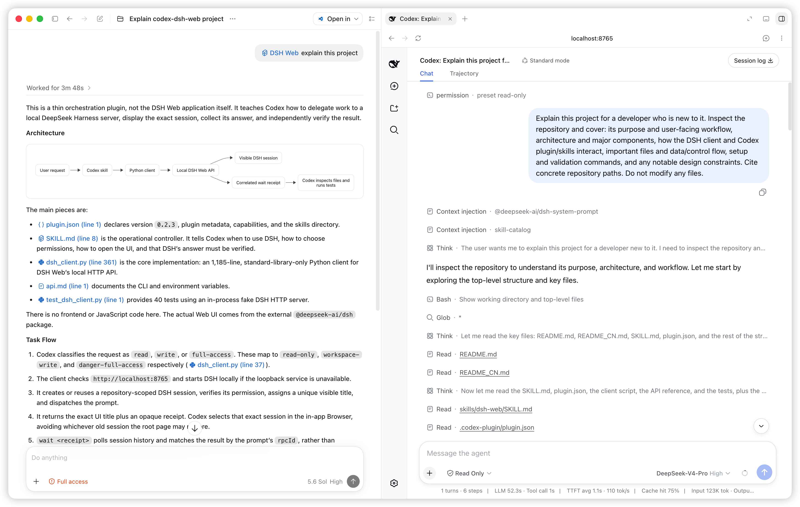

# DSH Web for Codex

English | [简体中文](README_CN.md)

`codex-dsh-web` is a small Codex plugin for delegating development work to a local [DeepSeek Harness](https://github.com/deepseek-ai/deepseek-harness) Web session.

Codex sends the task through DSH Web's local API, opens the exact active session in the in-app Browser side panel by default, then inspects the files and runs validation itself.



## What it does

- Reuses one local DSH Web service across multiple independent sessions.
- Creates or continues a session for the target repository.
- Chooses and verifies the DSH permission automatically.
- Sends a task and waits for the matching answer.
- Opens and selects the exact session in Codex Desktop's Browser side panel for every task.
- Keeps Codex responsible for reviewing changes and running tests.

The plugin does not make Codex call DSH for every request. It activates when you mention DSH Web, DeepSeek Harness Web, or explicitly use `$dsh-web`.

## Requirements

- Codex with plugin support.
- Python 3.9 or later.
- Node.js/npm and DeepSeek Harness:

```bash
npm install --global @deepseek-ai/dsh
dsh --version
```

- A model/API key configured for DSH Web.

The Python client uses only the standard library and supports macOS, Linux, and Windows. It does not depend on `zsh` or another login shell.

Plugin installation does not silently install Python, Node.js, npm, or DSH. When a dependency is missing, Codex reports it and asks before running an installer.

## Install

Add this GitHub repository as a Codex plugin marketplace, then install the plugin:

```bash
codex plugin marketplace add OpenNekoPaw/codex-dsh-web --ref main
codex plugin add codex-dsh-web@codex-dsh-web
```

Confirm the installation:

```bash
codex plugin marketplace list
codex plugin list
```

Start a new Codex task after installing or updating so the skill is loaded.

## Use

Explicit invocation is the most predictable:

```text
Use $dsh-web to fix the failing tests, then inspect the changes and run the tests yourself.
```

Natural language also works:

```text
Ask DSH Web to review this repository without changing files.
```

The live DSH trace opens by default; no extra UI instruction is required:

```text
Use $dsh-web to implement this feature.
```

Codex dispatches the task, opens DSH Web in the Browser side panel, selects the session by its unique title, verifies the visible conversation, and then waits for the result. This matters because DSH Web's root URL may otherwise restore an older session.

The plugin must not use Computer Use picture-in-picture or an external browser for this UI. If the in-app Browser side panel is unavailable, Codex reports that limitation instead of silently switching surfaces.

The default UI address is `http://localhost:8765`. Keep `localhost` in the Browser URL; some Codex in-app Browser environments stall on the equivalent `127.0.0.1` address. The managed DSH process still binds only to IPv4 loopback.

For teams that always want DSH delegation, add a short project instruction to `AGENTS.md`:

```markdown
For implementation or review tasks, use `$dsh-web`, then independently inspect and validate the result.
```

## Permission policy

Users do not configure DSH permissions manually. Codex maps task intent to the effective session preset:

| Task intent | DSH permission |
| --- | --- |
| Review, analysis, diagnosis, planning | `read-only` |
| Implementation, fixes, refactors, tests | `workspace-write` |
| Explicit work outside the workspace | `danger-full-access` |

The client applies the preset through DSH and verifies the reported effective value before sending the prompt. Model and agent-preset selection remain under DSH configuration.

## Update or remove

Refresh the marketplace snapshot and reinstall the current plugin version:

```bash
codex plugin marketplace upgrade codex-dsh-web
codex plugin add codex-dsh-web@codex-dsh-web
```

Remove the local installation:

```bash
codex plugin remove codex-dsh-web
```

## Troubleshooting

### DSH is not installed

Run the bundled diagnostic through Codex or directly:

```bash
python3 /path/to/plugin/skills/dsh-web/scripts/dsh_client.py doctor
```

It reports Python, npm, DSH, and server readiness, including the DSH install command.

### The Browser shows an old session

The skill dispatches the task first, then selects the exact returned title instead of relying on the root page's remembered state. If an old session remains visible, report it as a session-selection failure.

If DSH appears in Computer Use picture-in-picture, the wrong browser surface was selected. Start a new task with the updated plugin; the skill requires the in-app Browser side panel and forbids that fallback.

If the Browser remains on a loading state, confirm its address uses `localhost` rather than `127.0.0.1`.

### A session is already running

Wait for that session to finish or use a new session. The client prevents two local callers from treating the same DSH session as their own active turn.

## Development

The normal client surface is intentionally small:

```text
doctor
task
wait
debug
```

Run the test suite:

```bash
python3 -m unittest discover -s tests -v
```

See [the client reference](skills/dsh-web/references/api.md) for direct usage and low-level diagnostics.
